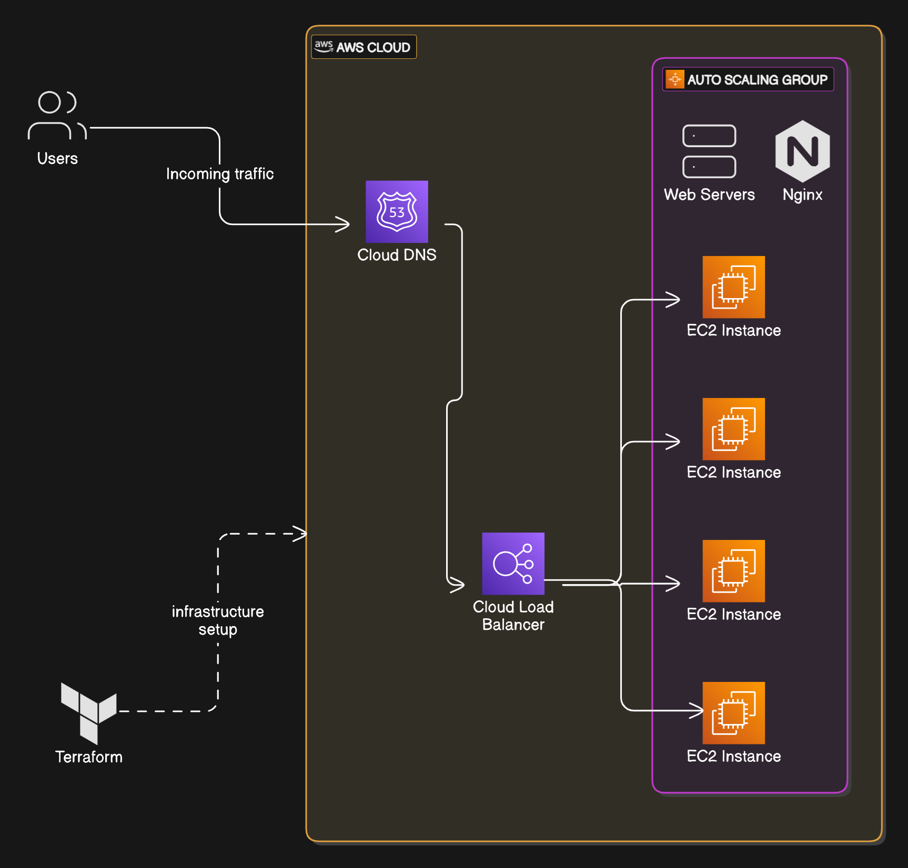

# DevOpsDream-Day2
Day 2 Project : Infrastructure as Code with Terraform

### Project Overview  

In this project, you’ll learn to use **Terraform**, a popular **Infrastructure as Code (IaC)** tool, to manage cloud resources efficiently. Terraform lets you define and set up your infrastructure in a **declarative way**, ensuring automation, consistency, and reduced manual errors.  

You’ll create **Terraform configuration files** to manage the EC2 web server, Auto Scaling group (ASG), load balancer, and DNS setup from your previous project. These files will help you automate the infrastructure setup process while enabling **version control** for better management.  

#### Key Commands  
In this exercise, you’ll work with basic Terraform commands:  
- **`init`**: Prepares your working directory for use with Terraform.  
- **`plan`**: Previews the actions Terraform will take to match your configuration.  
- **`apply`**: Executes the planned changes to create or update resources.  

---

### Real-World Example  
Terraform is a trusted tool in the tech industry for managing large-scale infrastructure. For instance, **Netflix** uses Terraform to manage its extensive infrastructure. This allows them to:  
- Deploy and update services quickly.  
- Track changes and ensure consistency across global deployments.  
- Replicate environments with ease.  

By using Terraform, Netflix ensures a reliable and seamless streaming experience for millions of users worldwide.  

---

### What You’ll Learn  

This project focuses on developing essential **IaC skills** that are crucial for modern DevOps workflows:  

- **Infrastructure as Code (IaC)**: Learn how to define infrastructure using code, making it repeatable and easy to version-control.  
- **Automation**: Simplify and automate the creation and management of cloud resources.  
- **Error Reduction**: Reduce manual configurations and minimize the chances of human errors.  

---

### How to Get Started  

1. **Install Terraform**  
   Download and install Terraform on your system: [Terraform Downloads](https://www.terraform.io/downloads.html)  

2. **Explore the Documentation**  
   Familiarize yourself with Terraform’s official documentation: [Terraform Documentation](https://developer.hashicorp.com/terraform/docs)  

3. **Learn About Providers**  
   Understand Terraform providers for platforms like Google Cloud, AWS, or Azure:  
   [Terraform Providers](https://developer.hashicorp.com/terraform/language/providers)  

4. **Practice with Tutorials**  
   Try hands-on tutorials to write Terraform configurations for common use cases:  
   - [Terraform Tutorial for AWS](https://developer.hashicorp.com/terraform/tutorials/aws-get-started)  

---

By completing this project, you’ll gain practical skills in using Terraform to manage infrastructure efficiently, a highly sought-after expertise in today’s DevOps landscape
